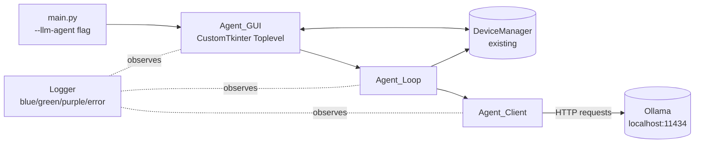
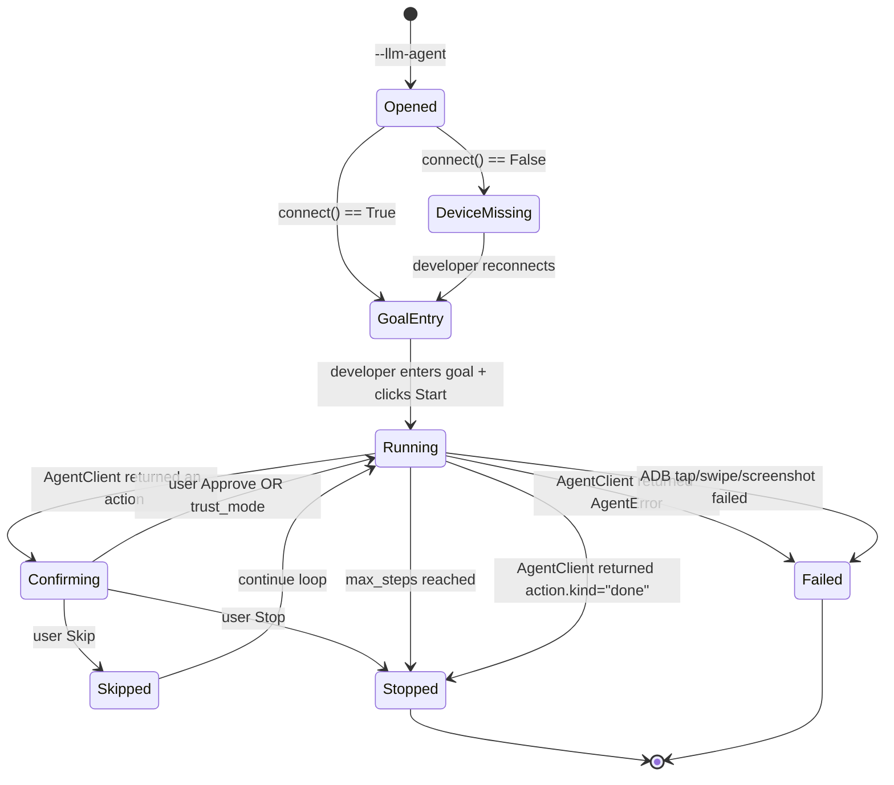

# LLM Agent — Design Document

**Date:** 2026-05-24
**Status:** Draft → pending user review
**Topic:** Dev-time-only autonomous AFK Arena agent powered by a local Ollama vision model.

## Overview

The **LLM Agent** is a dev-time tool that lets a developer give a high-level
text goal (e.g. "collect daily login reward") and watches a local multimodal
LLM (`qwen2.5vl:3b` via Ollama) drive the connected ADB device toward that
goal, one action at a time, with the developer approving each tap before it
fires.

It is a sibling of the existing **LLM Flow Recorder** (which captures human
recordings to scaffold new activity modules). Where the recorder is a *passive*
tool — human taps, LLM generates code afterwards — the agent is *active*: the
LLM looks at the current screen and emits the next action itself. The two
tools share infrastructure (Ollama config, image downscaling, structured error
handling) but live in separate packages because their state machines and
prompts diverge.

It is **not** a production runtime. The compiled `.exe`, `--dailies`,
`--autotower`, and `--tower` paths never touch this code. PyInstaller excludes
the package the same way it excludes the recorder.

### Scope reminders (explicit non-goals)

- Not invoked from the compiled `.exe`, `--dailies`, `--autotower`, or `--tower`.
- No replacement for the existing template-matching activity system; the agent
  exists alongside it, not as a substitute.
- No remote/cloud LLM providers — Ollama HTTP only.
- No autonomous "exploration" outside the goal text the user supplied.
- No memory/learning across sessions — each run starts fresh.

## Architecture

### Component map



All components live under `src/dev_tools/llm_agent/`, parallel to
`src/dev_tools/llm_recorder/`. The `AutoAFK.spec` `excludes` list adds
`'src.dev_tools.llm_agent'`.

### Wiring to existing infrastructure

| Existing object | How the agent uses it | Notes |
|---|---|---|
| `Config` (`src/core/config.py`) | Read `[LLM_TOOLING]` (shared with recorder) and a new `[LLM_AGENT]` section | Read-only |
| `DeviceManager` | `connect()`, `get_screenshot()`, `tap(x, y)`, `swipe(x1,y1,x2,y2)` | Same 10-second watchdog as the recorder |
| `Logger` | `Logger.get_logger(__name__)`; call `.blue()`, `.green()`, `.purple()`, `.error()` | Auto-screenshots on `error()` |
| `set_device_manager` | Wire device manager into `ScreenshotOnErrorHandler` so `logger.error()` auto-saves a screenshot | Same as recorder |

The agent does **not** instantiate `ImageRecognition`, `GameController`,
`ActivityManager`, or any activity class.

## Components and Interfaces

### Module layout

```
src/dev_tools/llm_agent/                   # NEW package, excluded from build
├── __init__.py
├── models.py                              # AgentAction, AgentStep, AgentSession, AgentError
├── prompt_templates.py                    # System prompt + per-step user-message rendering
├── agent_client.py                        # AgentClient.next_action(...) — Ollama HTTP wrapper
├── agent_loop.py                          # AgentLoop.run() — the main loop
└── agent_gui.py                           # AgentGUI(config, device_manager).mainloop()
```

The agent reuses Ollama wire-format helpers from the recorder where it can
(image base64, num_ctx handling), but does **not** import from
`src.dev_tools.llm_recorder` to keep the two packages independent.

### Component responsibilities

| Component | File | Public surface |
|---|---|---|
| `AgentGUI` | `agent_gui.py` | `AgentGUI(config, device_manager).mainloop()` |
| `AgentLoop` | `agent_loop.py` | `AgentLoop(client, device_manager, gui_callbacks).run(session) -> AgentResult` |
| `AgentClient` | `agent_client.py` | `next_action(goal, history, screenshot, config) -> AgentAction \| AgentError` |

`gui_callbacks` is a small dict-of-functions interface so the loop can call
back into the Tk main thread (`request_confirm(action) -> bool`,
`render_step(step)`, `render_error(err)`).

## Data Models

```python
# src/dev_tools/llm_agent/models.py

from dataclasses import dataclass, field
from typing import List, Optional, Tuple
from PIL import Image


@dataclass
class AgentAction:
    """One action proposed by the LLM."""
    kind: str                       # 'tap' | 'swipe' | 'wait' | 'done'
    rationale: str = ""             # one-sentence justification
    x: Optional[int] = None         # tap coords (kind='tap')
    y: Optional[int] = None
    x1: Optional[int] = None        # swipe from (kind='swipe')
    y1: Optional[int] = None
    x2: Optional[int] = None        # swipe to
    y2: Optional[int] = None
    seconds: float = 1.0            # wait duration (kind='wait')
    done_reason: str = ""           # only when kind='done'


@dataclass
class AgentStep:
    """One iteration of the loop, kept for history display."""
    index: int
    screenshot: Image.Image         # 1080×1920 device pixels
    proposed: AgentAction
    approved: bool = False
    executed: bool = False


@dataclass
class AgentSession:
    """In-memory state of one run."""
    goal: str
    steps: List[AgentStep] = field(default_factory=list)
    device_resolution: Tuple[int, int] = (1080, 1920)
    max_steps: int = 20
    history_window: int = 3
    trust_mode: bool = False


@dataclass
class AgentError:
    """Structured error returned by AgentClient or AgentLoop."""
    category: str                   # see "Error categories" below
    message: str
    raw_excerpt: str = ""
    ollama_host: str = ""
    model_name: str = ""
```

### Error categories

| Category | Trigger | UI behavior |
|---|---|---|
| `OLLAMA_UNREACHABLE` | TCP/HTTP connect/DNS error | Modal showing host + model; loop aborted; history kept |
| `OLLAMA_TIMEOUT` | `requests.exceptions.Timeout` | Modal showing host + model + timeout; loop aborted |
| `MODEL_MISSING` | 404 or `"model not found"` substring | Modal with verbatim upstream message |
| `INVALID_JSON` | `json.loads` fails on `message.content` | **Auto-retry once**, then modal with truncated body |
| `SCHEMA_VIOLATION` | JSON parses but fails validation | **Auto-retry once**, then modal with first failing path |
| `ADB_FAILURE` | `tap()`/`swipe()`/`get_screenshot()` raises or times out | Modal; loop aborted; history kept |
| `MAX_STEPS` | `step counter ≥ max_steps` without `done` | Soft modal; history kept |
| `USER_STOP` | User clicks **Stop** in GUI | No modal; history kept; treated as success-ish |

`raw_excerpt` is truncated to `error_excerpt_max_chars` (shared with the
recorder's `[LLM_TOOLING]` key, default 2000).

## Configuration

### Existing `[LLM_TOOLING]` section (shared with recorder)

The agent reuses these keys verbatim — same fallbacks, same semantics:

| Key | Type | Default | Used by agent? |
|---|---|---|---|
| `ollama_host` | str | `http://localhost:11434` | Yes |
| `model_name` | str | `qwen2.5vl:3b` | Yes |
| `request_timeout_s` | int | `300` | Yes |
| `error_excerpt_max_chars` | int | `2000` | Yes |
| `image_max_dim` | int | `1024` | Yes (downscale screenshots) |
| `num_ctx` | int | `8192` | Yes |
| `enabled` | bool | `False` | **Not used by agent** — see `[LLM_AGENT].enabled` below |

### New `[LLM_AGENT]` section

| Key | Type | Default | Source |
|---|---|---|---|
| `enabled` | bool | `False` | Hard gate: when `False`, the agent GUI shows the controls but the **Start** button is disabled and a tooltip explains why |
| `max_steps` | int | `20` | Default cap; the GUI may override per-run |
| `history_window` | int | `3` | Number of previous steps shown to the LLM (truncated to fit `num_ctx`) |
| `tap_settle_ms` | int | `1000` | Reused from `[LLM_TOOLING]` |

`settings.ini.example` ships the full block with `enabled=False`. Existing
`settings.ini` files are **not modified** by the recorder/agent code.

## Prompt Design

The agent prompt is **distinct** from the recorder's. Where the recorder asks
the LLM to draft Python source code from a sequence, the agent asks for a
single next action given a single screenshot.

### System prompt (concrete template)

```text
You are an automation agent driving an Android phone running the AFK Arena game.
You will be shown:
  - a high-level goal in plain English (e.g. "collect daily login reward")
  - an optional history of the last few actions you took, each with a short
    rationale and the screenshot that was on screen when you decided
  - the current screenshot (after the last action)

Your job is to produce ONE JSON object describing the SINGLE next action
toward the goal. Do not return prose. Do not return markdown. Do not wrap
the JSON in code fences. Return JSON only.

The JSON object MUST have one of these exact shapes:

  {"kind": "tap", "x": <0..{image_w}>, "y": <0..{image_h}>, "rationale": "<one short sentence>"}
  {"kind": "swipe", "x1": <int>, "y1": <int>, "x2": <int>, "y2": <int>, "rationale": "<one short sentence>"}
  {"kind": "wait", "seconds": <0.5..5.0>, "rationale": "<one short sentence>"}
  {"kind": "done", "done_reason": "<one short sentence summarising completion>"}

HARD CONSTRAINTS:
  - Coordinates MUST be inside the {image_w}x{image_h} screen.
  - Pick the SINGLE most likely action that advances the goal.
  - If the goal has clearly been achieved (the screenshot shows the
    expected end state), return kind="done".
  - If you are uncertain, prefer "wait" with a short delay over a random tap.
  - Do not propose a "tap" identical to the immediately previous "tap" if
    the screen did not change — try a different action.

The screenshots have been downscaled from the device's native 1080x1920
resolution to {image_w}x{image_h}. Coordinates you return must be in the
{image_w}x{image_h} space; the agent will rescale to device pixels.
```

The system prompt is rendered against the actual downscaled image dimensions
the same way the recorder's `build_system_prompt(image_w, image_h)` works.

### User-message framing

For the per-step request:

```text
Goal: <goal text>

History (last <N> steps):
  Step <i-3>: tap (450, 1290) — "Open daily reward icon"
  Step <i-2>: tap (540, 700)  — "Open Login Reward tab"
  Step <i-1>: tap (540, 1700) — "Tap Claim All"

Current screenshot is attached. Produce the JSON action.
```

History items only include rationale text + last action; previous screenshots
are NOT re-attached to keep the prompt small. The model sees just the most
recent screenshot.

## Agent Loop

### High-level state machine



### Per-iteration sequence

```mermaid
sequenceDiagram
    participant GUI as Agent_GUI
    participant Loop as Agent_Loop
    participant DM as DeviceManager
    participant Client as Agent_Client
    participant OL as Ollama
    GUI->>Loop: run(session)
    loop until done/stop/error/max_steps
        Loop->>DM: get_screenshot() [10s watchdog]
        DM-->>Loop: PIL.Image (1080x1920)
        Loop->>Client: next_action(goal, history, screenshot, config)
        Client->>OL: POST /api/chat (resized image, history text, system prompt)
        alt invalid JSON or schema violation
            Client->>OL: retry once
            alt still invalid
                Client-->>Loop: AgentError(INVALID_JSON|SCHEMA_VIOLATION)
            end
        end
        Client-->>Loop: AgentAction
        Loop->>GUI: render_step(AgentStep)
        alt session.trust_mode == False
            Loop->>GUI: request_confirm(action) [blocks loop thread]
            GUI-->>Loop: True (Approve) | False (Skip) | "stop"
            opt user clicked Stop
                Loop-->>GUI: AgentResult(stopped=True)
                Note over Loop: exit loop
            end
        end
        alt action.kind == "done"
            Loop-->>GUI: AgentResult(done=True, reason=...)
        else action.kind in {tap, swipe, wait}
            opt approved
                Loop->>DM: execute (tap/swipe/sleep) [10s watchdog]
                alt ADB failure
                    Loop-->>GUI: AgentError(ADB_FAILURE)
                end
            end
            Loop->>Loop: append AgentStep
            Loop->>Loop: sleep(tap_settle_ms / 1000.0)
        end
    end
```

### Threading model

The agent loop runs on a background `threading.Thread` started by the GUI's
**Start** button (same pattern as the recorder's "Analyze with LLM"). All Tk
mutations marshal back via `self.root.after(0, ...)`.

**Confirm dialog interaction:** when the loop thread reaches a confirm point,
it `put()`s on a `queue.Queue` and `get()`s the user's reply from a *response*
queue. The GUI thread has the inverse pattern. This keeps the loop thread off
the Tk main loop without blocking either side indefinitely.

## GUI Layout

CustomTkinter `CTk` window, 1280×800, two panes:

```
┌──────────────────┬───────────────────────────────────────────┐
│ Live preview     │ Goal:                                     │
│  (360×640 canvas │   [text entry: "Collect daily login..."]  │
│   like recorder) │                                           │
│                  │ [ Start ] [ Stop ] [ Trust mode ] [Reset] │
│                  │                                           │
│                  │ Step 0: tap (540, 1500)                   │
│ Status:          │   "Open daily reward icon"                │
│ state: Confirming│   [ Approve ] [ Skip ]                    │
│ steps: 3/20      │                                           │
│                  │ Step 1: wait 1.0s                         │
│                  │   "Wait for animation"                    │
│                  │   ✓ approved & executed                   │
│                  │                                           │
│                  │ Step 2: tap (560, 720)                    │
│                  │   "Tap Claim All"                         │
│                  │   ✓ approved & executed                   │
└──────────────────┴───────────────────────────────────────────┘
```

- **Goal entry** disabled while loop is running.
- **Start** disabled when `[LLM_AGENT].enabled == False`, with tooltip
  "Set [LLM_AGENT] enabled = True in settings.ini to use the agent."
- **Trust mode** toggle (default off) — when on, subsequent actions skip
  confirm. Can be turned off mid-run.
- **Stop** button always enabled while running.
- Each step card shows: index, action summary, rationale, status icon
  (pending / approved / skipped / executed / failed).
- Pending step also shows a **bbox overlay** on the source screenshot for
  `tap` and an arrow for `swipe`.

## Logging

| Event | Level | Message |
|---|---|---|
| Loop start | `logger.blue` | `Agent loop started: goal=...` |
| Each iteration | `logger.blue` | `step N: <action_kind>` |
| Approve & execute | `logger.green` | `step N: executed <action> at (x,y)` |
| Skip | `logger.purple` | `step N: skipped` |
| `done` returned | `logger.green` | `Agent done: <reason>` |
| Loop exhausted max_steps | `logger.purple` | `Agent reached max_steps=N without done` |
| Any error | `logger.error` | `agent_<category>: <message>` (auto-screenshot) |

## Entry Point & Isolation

### CLI flag

A new flag `--llm-agent` (alias `--la`) is added to `parse_arguments()` in
`main.py`, hidden from `--help` via `argparse.SUPPRESS`.

### Deferred imports

`run_llm_agent()` mirrors `run_llm_recorder()`:

```python
def run_llm_agent() -> None:
    from src.core.config import Config
    from src.core.device_manager import DeviceManager
    from src.utils.logger import Logger, set_device_manager

    Logger()
    config = Config('settings.ini')
    device_manager = DeviceManager(config)
    device_manager.connect()
    set_device_manager(device_manager)

    from src.dev_tools.llm_agent.agent_gui import AgentGUI
    AgentGUI(config=config, device_manager=device_manager).mainloop()
```

The `from src.dev_tools.llm_agent...` import sits **inside** the function
body, after the early-return checks, so static analyzers and the runtime
importer never reference the package when the flag is absent.

The dispatch chain in `main()`:

```python
if args.llm_agent:
    run_llm_agent()
elif args.llm_recorder:
    run_llm_recorder()
elif args.dailies:
    run_dailies_headless()
elif args.tower or args.autotower:
    run_tower_push_headless()
else:
    App().mainloop()
```

`--llm-agent` is checked BEFORE `--llm-recorder` in the dispatch chain
purely to keep the most recent tool first. If a user accidentally passes
both flags, argparse accepts both, and the first matching `if` branch
wins (i.e. agent runs, recorder is silently ignored). This is acceptable
because both flags are dev-only and hidden from `--help`.

### PyInstaller exclusion

`AutoAFK.spec` `excludes` list grows by one entry:

```python
excludes=[
    'matplotlib', 'scipy', 'pandas', 'flask', 'flask_socketio', 'plyer',
    # dev-only LLM Flow Recorder, Req 1.3
    'src.dev_tools',
    'src.dev_tools.llm_recorder',
    'src.dev_tools.llm_agent',  # NEW — dev-only LLM Agent
],
```

## Testing Strategy

Same approach as the recorder: example-based pytest tests under
`tests/dev_tools/llm_agent/`. No PBT.

| File | Coverage |
|---|---|
| `test_action_schema.py` | Parse JSON action: each kind valid, missing/wrong fields rejected, out-of-bounds coords rejected, retry logic, fully-valid happy path |
| `test_agent_client_errors.py` | Mock `requests.get/post`, cover all 8 error categories (`AgentClient` returns the structured `AgentError`) |

Reused fixtures from `tests/dev_tools/llm_recorder/` (tiny PIL images, fake `ConfigParser`).

The agent loop and GUI are not unit-tested:
- Loop requires a live Ollama and a real device, and its happy path is
  inherently non-deterministic
- GUI is CTk; smoke-tested manually

A manual smoke checklist will be created at
`docs/llm-agent-smoke-test.md` covering the 8 scenarios:

1. Launch with no device → "device not connected" banner, Start disabled.
2. Launch with `[LLM_AGENT].enabled=False` → Start disabled with tooltip.
3. Enter goal, click Start, Ollama down → `OLLAMA_UNREACHABLE` modal.
4. Enter goal, click Start, model missing → `MODEL_MISSING` modal.
5. Enter goal "open the menu", LLM proposes a tap → preview shows bbox; Approve fires the tap; preview refreshes.
6. Click Skip → step recorded as skipped, loop continues.
7. Click Stop mid-run → loop exits cleanly, no further taps.
8. Run until LLM returns `done` → green log message, controls re-enabled.

## Open Issues / Risks

1. **Model 3b on RTX 4060 8GB compute graph OOM.** Already observed: the
   compute graph for `qwen2.5vl:3b` is 6.7 GiB and we only have ~7.8 GiB free,
   so Ollama falls back to CPU offload. Per-step inference takes 30–60s on CPU.
   For a 20-step run that's 10–20 minutes. **Mitigation:** documented in
   smoke-test prerequisites; users can set `image_max_dim=512` to halve token
   count, or pull a smaller model.
2. **Goal interpretation is fragile.** "Collect daily login reward" works
   because the icon is consistent across patches, but a goal like "fight
   arena" is much vaguer. The README will explicitly recommend short, concrete
   goals like "tap the daily reward icon then claim all".
3. **No memory across runs.** Restarting the agent forgets every prior step.
   Acceptable for MVP; future work could persist a short-term episodic store.
4. **Trust mode is dangerous.** A drifting model can tap "Buy" buttons. The
   GUI shows a confirmation dialog the first time Trust mode is enabled
   warning that any in-game purchase confirmations could be auto-approved.

## Decisions Deferred to Implementation

- Exact pixel layout of the action card (e.g. how to render swipe arrow)
- Whether to add an "Edit action" button before approving
- Whether to log the LLM's full system+user message to `debug/llm_agent/`
  for offline replay
